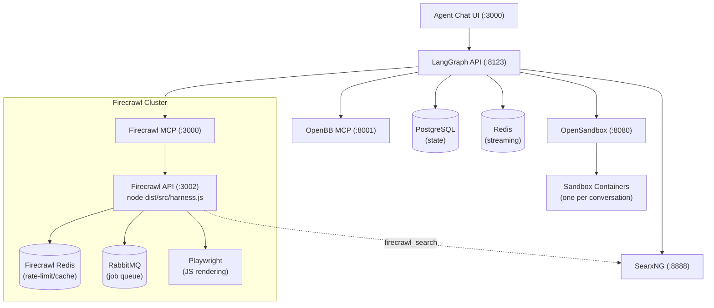

# Deployment Guide (Not suitable for production yet)

Deploy the Muffin Agent to a [LangGraph Standalone Server](https://docs.langchain.com/langsmith/deploy-standalone-server) (Self-Hosted Lite).

## Prerequisites

Complete the [Setup steps in the README](../README.md#-setup) first (install, OpenBB MCP server, OpenSandbox, environment variables).

Additionally you need:
- **Docker** and **Docker Compose**
- **LangSmith account** (free Developer plan) — [sign up](https://smith.langchain.com/)
- `LANGSMITH_API_KEY` in your `.env` — [get one here](https://smith.langchain.com/settings)

## Local Development (No Docker)

For development with hot-reload:

```bash
langgraph dev
```

Requires the OpenBB MCP server and the OpenSandbox server running on localhost, and all env vars set in `.env`.

Start OpenSandbox locally:

```bash
docker run -d --name opensandbox \
  -p 8080:8080 \
  -v /var/run/docker.sock:/var/run/docker.sock \
  ghcr.io/alibaba/opensandbox/server:latest
```

## Docker Deployment

### 1. Build the Docker image

```bash
langgraph build -t muffin-agent:latest
```

This uses `langgraph.json` to bundle the agent into a Docker image with all dependencies.

### 2. Configure OpenBB provider API keys

Copy the OpenBB env example and fill in your keys:

```bash
cp extras/openbb/.env.example extras/openbb/.env
```

See [extras/openbb/README.md](../extras/openbb/README.md) for which providers are free and where to get keys.

### 3. Configure Firecrawl

The `extras/firecrawl/.env` file is required (even if empty) since `docker-compose.yml` references it:

```bash
cp extras/firecrawl/.env.example extras/firecrawl/.env
```

The defaults in `.env.example` work for a local self-hosted setup with no authentication.

### 4. Run with Docker Compose

```bash
docker compose up
```

This starts twelve services:

| Service | Port | Role |
|---------|------|------|
| `langgraph-api` | 8123 | Agent server |
| `agent-chat-ui` | 3000 | Chat interface |
| `langgraph-postgres` | — | LangGraph state persistence |
| `langgraph-redis` | — | LangGraph streaming pub-sub |
| `opensandbox-server` | 8080 | Python sandbox container manager |
| `openbb-mcp` | 8001 | OpenBB MCP server |
| `searxng` | 8888 | Meta-search engine (aggregates multiple engines) |
| `firecrawl-redis` | — | Firecrawl rate-limit / cache store |
| `firecrawl-rabbitmq` | — | Firecrawl job queue (RabbitMQ) |
| `firecrawl-playwright` | — | Browser automation for JS-rendered pages |
| `firecrawl-api` | 3002 | Firecrawl HTTP API + workers (harness.js) |
| `firecrawl-mcp` | 3000 | Firecrawl MCP server |

Open [http://localhost:3000](http://localhost:3000) to use the chat UI.

### 5. Verify

```bash
curl http://localhost:8123/ok
# Expected: {"ok": true}

# Verify SearxNG
curl 'http://localhost:8888/search?q=test&format=json' | jq '.results[0].title'

# Verify Firecrawl
curl http://localhost:3002/health
```

## Using the Deployed Agent

### Via API

```bash
curl -X POST http://localhost:8123/runs/stream \
  -H "Content-Type: application/json" \
  -d '{
    "input": {"messages": [{"role": "user", "content": "Analyze AAPL"}]},
    "assistant_id": "stock_evaluation"
  }'
```

### Via Agent Chat UI

Open [http://localhost:3000](http://localhost:3000) — the chat UI is included in Docker Compose and pre-configured to connect to the agent server.

Alternatively, use the hosted version at [agentchat.vercel.app](https://agentchat.vercel.app/) and point it to `http://localhost:8123`.

### Via LangSmith Studio

Open [LangSmith Studio](https://smith.langchain.com/) — your deployed agent will appear under deployments.

## Architecture



**Sandbox lifecycle**: Each chat conversation gets its own isolated container.
Sandboxes are discovered lazily by `thread_id` metadata — `get_backend` and
`execute_python` call the OpenSandbox API to find a running container tagged
with the current `thread_id`. If none exists, a new container is created
automatically. If the container dies mid-conversation (e.g. 1-hour timeout,
container crash), a new container is created transparently on the next call
(in-sandbox state like installed packages or written files is lost).
Containers auto-terminate after a 1-hour idle timeout.

**Web search architecture**: SearxNG aggregates results from multiple search
engines (Google, Bing, DuckDuckGo, Brave, etc.) and serves them to both the
agent directly (via `searx_search_results` LangChain tool) and to the
Firecrawl API (via `SEARXNG_ENDPOINT` env var, used by `firecrawl_search`).
Firecrawl workers use RabbitMQ for job queuing and Playwright for
JavaScript-rendered pages, enabling scraping of complex sites.

## Environment Variables

Key environment variables set in docker-compose.yml (override in `.env`):

| Variable | Service | Description |
|----------|---------|-------------|
| `OPENBB_MCP_URL` | langgraph-api | OpenBB MCP server URL |
| `FIRECRAWL_MCP_URL` | langgraph-api | Firecrawl MCP server URL |
| `SEARXNG_SECRET_KEY` | searxng | Secret key for SearxNG (set in `.env`) |
| `FIRECRAWL_API_KEY` | firecrawl-mcp | API key for Firecrawl (default: `local`) |
| `OPENSANDBOX_API_KEY` | opensandbox-server | Sandbox auth key (optional) |

## Production Considerations

The current Docker Compose setup is intended for **local development**. Before deploying to a production environment, address the following:

### Security
- [ ] **Database credentials** — Replace hardcoded `postgres:postgres` with strong credentials via environment variables or secrets manager
- [ ] **Redis authentication** — Enable `requirepass` on Redis
- [ ] **TLS/HTTPS** — Add a reverse proxy (nginx, Traefik, or Caddy) for HTTPS termination
- [ ] **API authentication** — The LangGraph API has no auth by default; add authentication at the proxy layer or via LangSmith API keys
- [ ] **OpenSandbox authentication** — Set `OPENSANDBOX_API_KEY` and `SANDBOX_API_KEY` in the compose environment to require auth on the sandbox server
- [ ] **Sandbox image** — Set `OPENSANDBOX_IMAGE` to a hardened custom image with only the required packages; avoid `python:3.11-slim` in production as it allows arbitrary package installation at runtime
- [ ] **SearxNG secret key** — Set a strong random `SEARXNG_SECRET_KEY` in `.env` (the default `changeme-set-in-env` is insecure)

### Reliability
- [ ] **Postgres backups** — Set up periodic `pg_dump` or use a managed database service
- [ ] **Resource limits** — Add `mem_limit` / `cpus` constraints to containers
- [ ] **Logging** — Configure centralized log collection (e.g., `docker compose logs` to a log aggregator)

### Build reproducibility
- [ ] **Pin Agent Chat UI version** — The Dockerfile clones `main` at build time; pin to a specific commit or tag for reproducible builds

## Limits & Alternatives

**Self-Hosted Lite** is free up to **1 million node executions**. After that, upgrade to Self-Hosted Enterprise (contact LangChain sales).

**Alternative — [Aegra](https://github.com/ibbybuilds/aegra)**: An open-source, Apache 2.0 licensed drop-in replacement for LangSmith Deployments. Free and unlimited. Compatible with the same LangGraph SDK, Agent Chat UI, and CopilotKit. Includes OpenTelemetry tracing (works with Langfuse).
